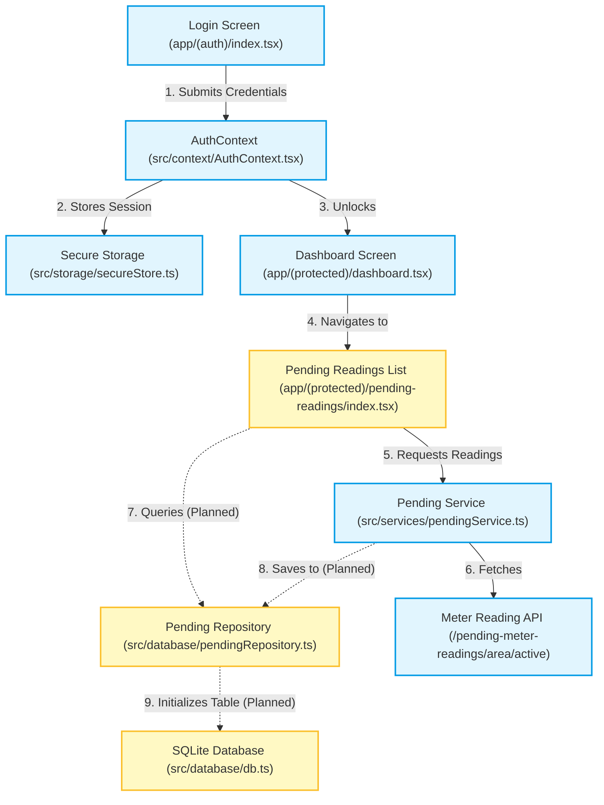

# Bulk Meter Reading - Mobile Application Development

This document provides a comprehensive summary of the development progress of the **Bulk Meter Reader Mobile Application**, tracking our position along the defined [Development Roadmap.txt](file:///d:/CEB%20PROJECTS/mtr-rdng/Development%20Roadmap.txt).

---

## 📊 Roadmap Overview & Current Status

Our current position is in **Step 3: Download Pending Readings**. Below is the status checklist of the overall roadmap:

| Step | Milestone | Status | Details |
| :--- | :--- | :---: | :--- |
| **1** | **Project Setup** | 🟢 **100% Complete** | Expo SDK 54 initialization, File-based routing (`expo-router`), SQLite database setup (`expo-sqlite`). |
| **2** | **Authentication** | 🟢 **100% Complete** | TypeScript models, Axios base client, Secure Store token persistence, Context-based guards. |
| **3** | **Download Pending Readings** | 🟡 **40% In Progress** | API integration and UI are ready. Database synchronization (caching locally) is pending. |
| **4** | **Reading Capture** | 🔴 **0% Pending** | Customer detail entry screen, validation rules (current >= previous), and local DB updates. |
| **5** | **Synchronization** | 🔴 **0% Pending** | Upload payload building, unsynced readings batch uploads, status markers. |
| **6** | **Polish** | 🔴 **0% Pending** | Connection health checks, search/filter indexes, loading indicators. |

---

## 🏗️ Architecture & Component Flow

The diagram below illustrates how components interact, highlighting completed features (green) and what is currently being integrated under Step 3 (yellow):

---

## 📂 Detailed Progress Analysis

### 🟢 Done: Step 1 & 2 - Setup & Authentication
We have successfully constructed a fully functioning authentication loop, utilizing local secure storage for persistence:

1. **Routing and Structure**: Created root layouts with path configurations using `expo-router`.
   - [app/_layout.tsx](file:///d:/CEB%20PROJECTS/mtr-rdng/app/_layout.tsx) initializes the `AuthProvider`.
   - [app/(auth)/_layout.tsx](file:///d:/CEB%20PROJECTS/mtr-rdng/app/(auth)/_layout.tsx) handles unauthenticated routes.
   - [app/(protected)/_layout.tsx](file:///d:/CEB%20PROJECTS/mtr-rdng/app/(protected)/_layout.tsx) secures application dashboards and customer listings.
2. **API Communication**:
   - [src/api/apiClient.ts](file:///d:/CEB%20PROJECTS/mtr-rdng/src/api/apiClient.ts) configures Axios with base URL (`http://10.128.1.59:8080/HSB/api/v1`) and appropriate headers.
   - [src/api/authApi.ts](file:///d:/CEB%20PROJECTS/mtr-rdng/src/api/authApi.ts) connects login payloads to endpoint `/secinfo/login`.
3. **Session & Security Layer**:
   - [src/storage/secureStore.ts](file:///d:/CEB%20PROJECTS/mtr-rdng/src/storage/secureStore.ts) interacts with `expo-secure-store` to keep sessions safely on disk.
   - [src/services/authService.ts](file:///d:/CEB%20PROJECTS/mtr-rdng/src/services/authService.ts) handles business logic, transforming API user info into state-stored session payloads.
   - [src/context/AuthContext.tsx](file:///d:/CEB%20PROJECTS/mtr-rdng/src/context/AuthContext.tsx) exposes hooks for reactive session updates.
4. **UI Design**:
   - Built a sleek, branded login layout with password toggle and loading states.
   - Designed a responsive dashboard card displaying meter reading metrics using SVG donut charts: [src/components/MeterReadingDashboard.tsx](file:///d:/CEB%20PROJECTS/mtr-rdng/src/components/MeterReadingDashboard.tsx).

---

### 🟡 In Progress: Step 3 - Download Pending Readings

We are currently transitioning between step 3 tasks:

- **What has been done**:
  1. **API layer complete**: Integrated the active area endpoint `/pending-meter-readings/area/active` inside [src/api/pendingApi.ts](file:///d:/CEB%20PROJECTS/mtr-rdng/src/api/pendingApi.ts).
  2. **Service layer complete**: [src/services/pendingService.ts](file:///d:/CEB%20PROJECTS/mtr-rdng/src/services/pendingService.ts) extracts user context (like `sessionId` and `areaCode`) directly from storage and maps the API parameter constraints.
  3. **List UI built**: Created [app/(protected)/pending-readings/index.tsx](file:///d:/CEB%20PROJECTS/mtr-rdng/app/(protected)/pending-readings/index.tsx) with search fields, sort order selection, limit filters, and data card displays.
- **What is missing (Remaining for Step 3 completion)**:
  1. **Database Schema Update**: The `db.ts` file currently initializes a generic `bills` table. It needs a structured `pending_readings` table matching the API's fields (`installationId`, `netTypeName`, `tariffCode`, `customerCategory`, etc.) to act as a local cache.
  2. **Database Cache Writer**: [src/database/pendingRepository.ts](file:///d:/CEB%20PROJECTS/mtr-rdng/src/database/pendingRepository.ts) is currently a blank file. It should contain SQLite queries to insert downloaded pending records in bulk.
  3. **UI Integration**: The list interface currently fetches records directly from the service layer (remote network API call) on initialization. It needs to:
     - Query local SQLite database first to ensure offline-first capability.
     - Provide a "Sync/Download" trigger to update local SQLite records from the remote server when connected.

---

## 🚀 Next Action Plan

To wrap up Step 3 and prepare for Step 4, we must complete the following items:

1. **Define SQLite Table**: Update [src/database/db.ts](file:///d:/CEB%20PROJECTS/mtr-rdng/src/database/db.ts) to define a table configuration that models the structures defined in [src/types/PendingReading.ts](file:///d:/CEB%20PROJECTS/mtr-rdng/src/types/PendingReading.ts).
2. **Implement SQLite Repo**: Implement insert, fetch, and search logic in [src/database/pendingRepository.ts](file:///d:/CEB%20PROJECTS/mtr-rdng/src/database/pendingRepository.ts).
3. **Refactor Screen logic**: Update the List screen to consume data from SQLite and add a manual download/refresh method.
4. **Develop Reading Input**: Build the Reading Entry form modal/screen representing Step 4 of the roadmap.
